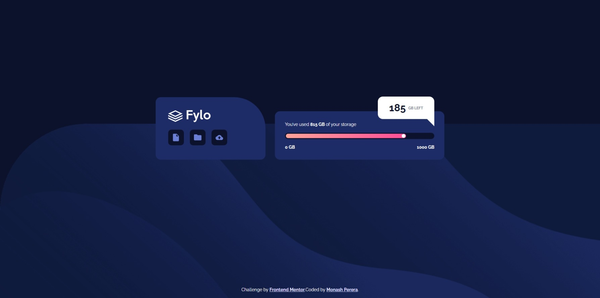
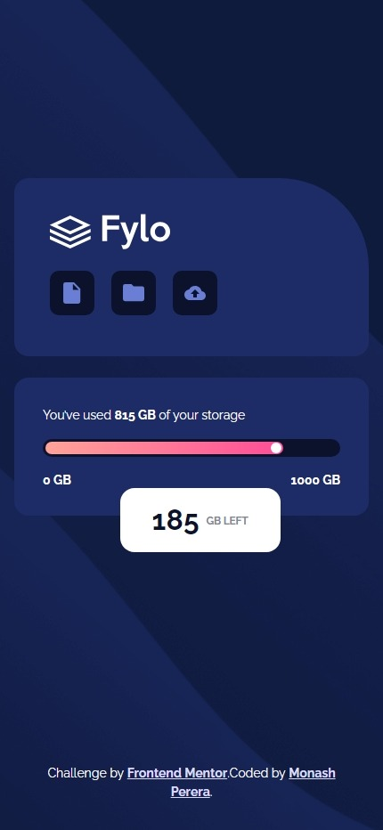

# Frontend Mentor - Fylo data storage component solution

This is a solution to the [Fylo data storage component challenge on Frontend Mentor](https://www.frontendmentor.io/challenges/fylo-data-storage-component-1dZPRbV5n). Frontend Mentor challenges help you improve your coding skills by building realistic projects. 

## Table of contents

- [Overview](#overview)
  - [The challenge](#the-challenge)
  - [Screenshot](#screenshot)
  - [Links](#links)
- [My process](#my-process)
  - [Built with](#built-with)
- [Author](#author)
- [Acknowledgments](#acknowledgments)

## Overview

### The challenge

Users should be able to:

- View the optimal layout for the site depending on their device's screen size

### Screenshot
Desktop Preview

Mobile Preview

### Links

- Live Site URL: [https://monashperera.github.io/fylo-data-storage-component/](https://monashperera.github.io/fylo-data-storage-component/)

## My process

### Built with

- Semantic HTML5 markup
- CSS custom properties
- Flexbox
- Mobile-first workflow
- [React](https://reactjs.org/) - JS library
- [Bootstrap 5](https://getbootstrap.com) - CSS framework

## Author

- Frontend Mentor - [@monashperera](https://www.frontendmentor.io/profile/monashperera)

## Acknowledgments

Thank you frontendmentor 👍👨‍💻.
